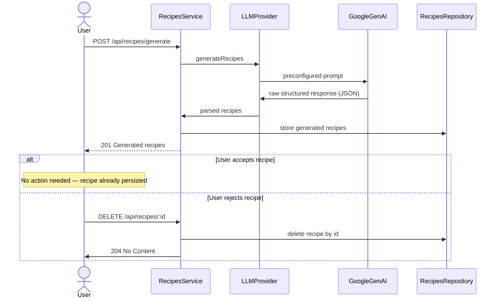

# Mealmajor Recipe Generation LLM Provider

To generate recipes we decided to use Google Gemini API and its [Structured outputs](https://ai.google.dev/gemini-api/docs/structured-output?example=recipe) feature. This guarantees the LLM produces a response format our service understands.

## Recipe generation prompt

The following prompt is used to generate recipes that comply with MealMajor API contract. The count and ingredients parameters are attached to the prompt using JS string templates.

```
Generate at most {count} recipe(s) using some or all of the following ingredients: {ingredients}.

For each recipe:
- Use realistic quantities and units (g, ml, tbsp, tsp, cup, cloves)
- Assign a difficulty: "easy", "medium", or "hard"
- Estimate prep time in minutes
- Estimate cost as a non-negative number (USD)
- List any allergens present
- List applicable dietary tags (e.g. "vegan", "gluten-free")
- Specify the number of servings
- Write clear, numbered prep steps using markdown formatting for lists and emphasis. Each step should be in a new line, use newline characters \n.

Additional common pantry ingredients needed to complete the recipe should be included in the recipe steps, but do not need to be listed in the ingredients.
Do NOT generate any of the following recipes: {excludedRecipes}.
```

## Recipe Generation Flow

<!-- Use a mermaid compatible renderer to see the diagram. For VSCode install the mermaid extension. You can also render these on GitHub. -->



## Dependency Injection and Unit Testing

We used dependency injection to decouple our service from GeminiAPI implementation. This approach gives us some important advantages:

1. Recipe generation flow can be unit tested. To mock the LLM provider, we just need to create a new class that implements the `LLMProvider` interface. This mock can be used to test scenarios such as: LLM failure or the happy path.

2. LLM provider replacement, if there's a need to change LLM provider e.g. from Gemini to GPT. We could simply provide a new implementation for the new LLM, the code in the service layer remains unchanged.